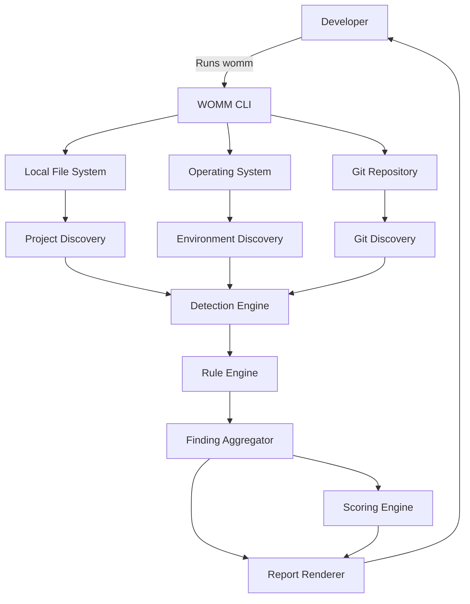
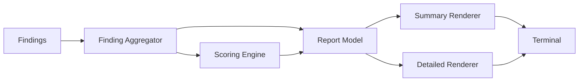
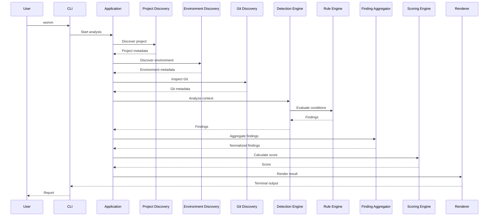
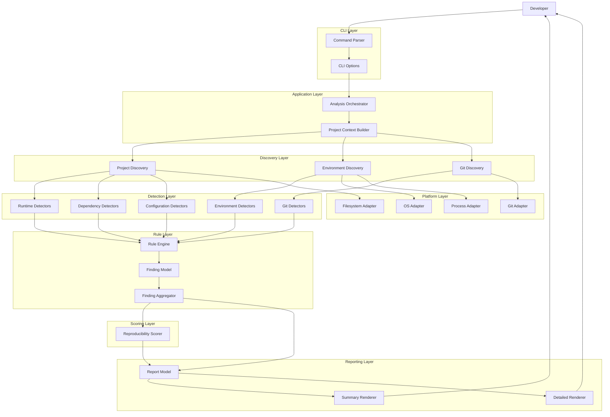

# WOMM — Architecture Specification

**Project:** works-on-my-machine<br>
**CLI:** `womm`<br>
**Document:** Architecture Specification<br>
**Version:** 1.0<br>
**Status:** V1 Architecture<br>
**Last Updated:** 2026-09-08<br>

---

# 1. Purpose

This document defines the technical architecture of WOMM V1.

WOMM is a local-first, read-only CLI that analyzes a software project's repository and the machine it is running on to identify reproducibility risks.

The architecture is designed around five requirements:

1. **Deterministic analysis**
2. **Read-only execution**
3. **Modular detection rules**
4. **Fast execution**
5. **Future extensibility**

The architecture must allow new detectors and rules to be added without restructuring the core application.

---

# 2. Architecture Overview

At a high level:

```text
User
 │
 │ womm
 ▼
CLI Layer
 │
 ▼
Application Orchestrator
 │
 ├───────────────┐
 ▼               ▼
Project       Environment
Discovery     Discovery
 │               │
 └───────┬───────┘
         ▼
   Detection Engine
         │
         ▼
     Rule Engine
         │
         ▼
 Finding Aggregator
         │
 ├──────────────┐
 ▼              ▼
Scoring       Reporter
Engine          │
 │              ▼
 └──────────► Terminal
```

The architecture separates **what is detected** from **how findings are interpreted** and **how findings are displayed**.

---

# 3. System Design

## 3.1 System Context



WOMM interacts only with the local machine in V1.

There is no external service dependency.

---

# 4. Core Architectural Principle

WOMM should be treated as a pipeline:

```text
Discover
   ↓
Collect
   ↓
Detect
   ↓
Evaluate
   ↓
Aggregate
   ↓
Score
   ↓
Render
```

Each stage has a specific responsibility.

No stage should silently perform another stage's responsibility.

For example:

- A detector should not render terminal output.
- The renderer should not inspect the filesystem.
- The scoring engine should not execute shell commands.
- The CLI should not contain detection logic.

This separation is fundamental to maintainability and testing.

---

# 5. Layered Architecture

WOMM V1 is divided into seven logical layers.

```text
┌──────────────────────────────────────┐
│              CLI Layer               │
├──────────────────────────────────────┤
│          Application Layer           │
├──────────────────────────────────────┤
│           Detection Layer            │
├──────────────────────────────────────┤
│             Rule Layer               │
├──────────────────────────────────────┤
│           Scoring Layer              │
├──────────────────────────────────────┤
│         Reporting / UI Layer         │
├──────────────────────────────────────┤
│      Platform / Filesystem Layer     │
└──────────────────────────────────────┘
```

---

# 6. CLI Layer

The CLI layer is the public interface.

Responsibilities:

- Parse command-line arguments.
- Resolve target project path.
- Select command.
- Configure execution.
- Invoke the application layer.
- Handle process exit codes.

The CLI layer must not contain business logic.

Example:

```bash
womm
womm check
womm check ./my-project
```

The CLI should eventually support:

```bash
womm --help
womm --version
```

---

# 7. Application Layer

The application layer orchestrates the analysis.

Primary responsibility:

> Coordinate the analysis pipeline without implementing individual detection rules.

Conceptual flow:

```text
CLI
 ↓
Application Runner
 ↓
Project Context
 ↓
Collectors
 ↓
Detectors
 ↓
Rules
 ↓
Findings
 ↓
Score
 ↓
Report
```

The application layer owns the lifecycle of a scan.

---

# 8. Project Context

Every analysis should operate on a standardized project context.

Conceptually:

```text
ProjectContext
│
├── rootPath
├── projectFiles
├── environment
├── git
├── runtime
├── packageManager
└── metadata
```

The context provides a consistent snapshot of the project and environment to detection rules.

The context should be constructed once where practical rather than repeatedly reading the same files.

---

# 9. Project Discovery

Project discovery determines what kind of project WOMM is analyzing.

Potential indicators include:

```text
package.json
package-lock.json
pnpm-lock.yaml
yarn.lock
bun.lock
requirements.txt
pyproject.toml
pom.xml
build.gradle
Cargo.toml
go.mod
```

V1 should prioritize ecosystems with strong implementation support rather than pretending to fully understand every language.

Initial priority:

```text
1. Node.js
2. Python
3. Generic project metadata
```

Additional ecosystems can be added later.

---

# 10. Environment Discovery

Environment discovery captures information about the current machine.

Examples:

```text
Operating system
CPU architecture
Node.js version
Python version
Java version
Package manager
Shell
Current working directory
Environment variable names
Git installation
```

The discovery layer must avoid collecting sensitive values unnecessarily.

For environment variables:

```text
DATABASE_URL=secret
```

should become:

```text
DATABASE_URL → present
```

not:

```text
DATABASE_URL → secret
```

---

# 11. Git Discovery

Git discovery collects repository state.

Potential information:

```text
Repository detected
Current branch
Working tree state
Tracked files
Ignored files
Tracked .env
Lockfile tracking
```

Git operations must be read-only.

WOMM must never execute:

```text
git checkout
git commit
git reset
git clean
git push
```

during analysis.

---

# 12. Detection Engine

The Detection Engine converts collected project/environment information into potential findings.

It should be modular.

```text
Detection Engine
│
├── Runtime Detectors
│   ├── Node
│   ├── Python
│   └── Java
│
├── Dependency Detectors
│   ├── Lockfile
│   ├── Package Manager
│   └── Global Dependencies
│
├── Environment Detectors
│   ├── Dotenv
│   ├── Localhost
│   ├── Absolute Paths
│   └── Environment Variables
│
├── Configuration Detectors
│   ├── Scripts
│   ├── Framework
│   └── Service Dependencies
│
└── Git Detectors
    ├── Tracked Environment Files
    ├── Missing Files
    └── Repository State
```

Each detector should have one focused responsibility.

---

# 13. Detector Contract

A detector should conceptually implement:

```text
Detector
├── id
├── category
├── supports(context)
└── analyze(context)
```

Example:

```text
NodeRuntimeDetector

supports(context)
→ true when package.json or Node indicators exist

analyze(context)
→ inspect declared Node version
→ inspect installed Node version
→ produce finding if mismatch/risk exists
```

Detectors should return findings or structured intermediate results.

They should not print anything.

---

# 14. Rule Engine

The Rule Engine evaluates detected conditions.

A detector may discover:

```text
Node version is not pinned.
```

The rule engine determines:

```text
Severity: WARNING
Impact: Medium
Score penalty: X
Recommendation: Pin Node.js version.
```

This separation allows detection logic and policy logic to evolve independently.

---

# 15. Rule Structure

Every rule should contain:

```text
Rule
│
├── id
├── category
├── severity
├── title
├── description
├── impact
├── recommendation
└── evaluation logic
```

Example:

```text
Rule ID:
RUNTIME-001

Condition:
Project requires Node >=20
Current Node <20

Severity:
CRITICAL

Title:
Node.js version mismatch

Recommendation:
Install a compatible Node.js version.
```

---

# 16. Finding Model

All detected issues must be converted into a common finding structure.

Conceptually:

```text
Finding
│
├── id
├── category
├── severity
├── title
├── description
├── evidence
├── impact
└── recommendation
```

Example:

```text
{
  id: "ENV-001",
  category: "environment",
  severity: "warning",
  title: "Environment variables are not documented",
  description: "...",
  evidence: ["DATABASE_URL", "REDIS_URL"],
  impact: "...",
  recommendation: "Create or update .env.example."
}
```

The actual TypeScript type should be defined in the domain model.

---

# 17. Finding Aggregation

Multiple detectors may identify related problems.

The Finding Aggregator is responsible for:

- Collecting findings.
- Removing duplicates.
- Normalizing findings.
- Ordering findings.
- Preparing findings for scoring and reporting.

Example:

```text
Detector A
   ↓
ENV-001

Detector B
   ↓
ENV-001

        ↓

Aggregator

        ↓

Single ENV-001 finding
```

---

# 18. Scoring Engine

The Scoring Engine converts findings into the reproducibility score.

Input:

```text
Finding[]
```

Output:

```text
Score
```

The score must be:

- Deterministic.
- Explainable.
- Bounded from 0 to 100.
- Based only on defined rules.

Conceptual model:

```text
100
 │
 ├── Critical penalties
 ├── Warning penalties
 └── Informational findings
 │
 ▼
Final score
```

The exact scoring algorithm belongs in:

```text
docs/SCORING.md
```

The scoring engine should never make assumptions outside the documented scoring model.

---

# 19. Reporting Layer

The Reporting Layer converts the analysis result into human-readable terminal output.

Input:

```text
AnalysisResult
```

Output:

```text
Terminal UI
```

The renderer should support at least:

```text
Summary
Detailed findings
Score
Recommendations
```

It must not perform analysis.

---

# 20. Output Architecture



This allows future renderers without changing the analysis engine.

Potential future outputs:

```text
Terminal
JSON
Markdown
CI-friendly text
```

Only terminal output is required for V1.

---

# 21. Complete Data Flow



---

# 22. Recommended Source Structure

The implementation should follow a structure similar to:

```text
src/
│
├── cli/
│   ├── index.ts
│   ├── commands/
│   │   ├── check.ts
│   │   └── index.ts
│   └── options.ts
│
├── application/
│   ├── analyzer.ts
│   └── context-builder.ts
│
├── domain/
│   ├── finding.ts
│   ├── score.ts
│   ├── project.ts
│   └── analysis-result.ts
│
├── discovery/
│   ├── project/
│   ├── environment/
│   └── git/
│
├── detectors/
│   ├── runtime/
│   ├── dependencies/
│   ├── environment/
│   ├── configuration/
│   └── git/
│
├── rules/
│   ├── runtime/
│   ├── dependencies/
│   ├── environment/
│   ├── configuration/
│   └── git/
│
├── scoring/
│   └── scorer.ts
│
├── reporting/
│   ├── renderer.ts
│   ├── summary.ts
│   └── detailed.ts
│
├── platform/
│   ├── filesystem.ts
│   ├── process.ts
│   └── shell.ts
│
└── index.ts
```

This is a recommended logical structure, not a requirement to create every file immediately.

---

# 23. Domain vs Infrastructure

WOMM should distinguish between domain logic and machine interaction.

## Domain

Pure logic:

```text
Finding
Severity
Score
Rules
Analysis Result
```

These should be highly testable without a real filesystem.

## Infrastructure

Machine interaction:

```text
Filesystem
Process execution
Git commands
OS detection
Runtime version detection
```

Infrastructure code should be isolated behind interfaces where practical.

---

# 24. Platform Abstraction

Because WOMM needs to work across operating systems, platform-specific behavior must not leak throughout the application.

Target operating systems:

```text
Windows
macOS
Linux
```

Example:

```text
Platform Layer
│
├── filesystem
├── process execution
├── path handling
├── OS detection
└── command resolution
```

The rest of the application should consume normalized data.

---

# 25. Filesystem Rules

Filesystem access should follow these principles:

- Resolve paths safely.
- Respect the project root.
- Avoid scanning unnecessary directories.
- Ignore `.git` internals unless specifically required.
- Avoid scanning dependency directories such as `node_modules`.
- Never read file contents unnecessarily.
- Never modify files.

Large generated directories should be excluded from scanning.

Examples:

```text
node_modules/
.git/
dist/
build/
coverage/
.cache/
```

The exact ignore strategy should be centralized.

---

# 26. Process Execution

Some information can only be obtained by executing local commands.

Examples:

```bash
node --version
python --version
git status
git branch
```

Process execution must:

- Have explicit commands.
- Avoid shell interpolation where possible.
- Capture stdout/stderr safely.
- Handle missing commands.
- Handle non-zero exit codes.
- Avoid destructive commands.

The application should not execute arbitrary strings derived directly from project files.

---

# 27. Error Handling

WOMM should distinguish between:

### Finding

The project has a reproducibility issue.

Example:

```text
Node version mismatch
```

### Analysis error

WOMM could not inspect something.

Example:

```text
Git is not installed.
```

### Fatal application error

WOMM itself cannot continue.

Example:

```text
Unable to access target directory.
```

These must not be conflated.

---

# 28. Partial Analysis

One detector failing should not necessarily terminate the entire scan.

Example:

```text
Git detector → fails
Node detector → succeeds
Environment detector → succeeds
```

WOMM should still produce:

```text
Analysis completed with limited Git information.
```

Only unrecoverable errors should terminate the analysis.

---

# 29. Caching

V1 should avoid premature caching.

Most scans should be fast enough without persistent caching.

In-memory reuse within a single scan is acceptable.

For example:

```text
Read package.json once
        ↓
Reuse parsed result
```

Persistent cache files should not be introduced unless performance measurements justify them.

---

# 30. Concurrency

Independent detectors may eventually run concurrently.

Conceptually:

```text
                Context
                   │
        ┌──────────┼──────────┐
        ▼          ▼          ▼
     Runtime    Environment   Git
        │          │          │
        └──────────┼──────────┘
                   ▼
                Findings
```

However, correctness comes before concurrency.

V1 should only parallelize operations where:

- There is no dependency between them.
- Output ordering remains deterministic.
- Error handling remains predictable.

---

# 31. Determinism

Given the same:

```text
Project state
+
Machine state
+
WOMM version
```

the analysis should produce equivalent findings.

Avoid:

- Random scoring.
- Time-dependent rules unless explicitly required.
- Network-dependent checks.
- Non-deterministic ordering.

Findings should have stable IDs.

---

# 32. Extensibility Model

The detector/rule architecture should allow new capabilities to be added without modifying the core pipeline.

Example:

```text
Existing:

Runtime
Dependencies
Environment
Git

New:

Database
Framework
Cloud configuration
CI configuration
```

A new detector should be able to register itself with the detection system.

Conceptually:

```text
Detector Registry
│
├── NodeRuntimeDetector
├── PythonRuntimeDetector
├── LockfileDetector
├── EnvDetector
├── LocalhostDetector
├── AbsolutePathDetector
└── GitDetector
```

The core analyzer should not need to know implementation details of every detector.

---

# 33. Configuration

WOMM should avoid requiring a configuration file in V1.

Zero configuration should be the default.

Eventually, projects may support something such as:

```text
.womm/
womm.config.*
```

for:

- Custom rules.
- Ignored findings.
- Score thresholds.
- Project-specific requirements.

This is future scope unless implementation requires a minimal configuration mechanism.

---

# 34. Security Architecture

WOMM is not a security scanner, but its architecture must still be security-conscious.

Rules:

1. Never expose environment variable values.
2. Never upload project data.
3. Never execute arbitrary project-provided commands.
4. Never modify the repository in V1.
5. Never follow symlinks outside the project without explicit handling.
6. Avoid shell injection.
7. Sanitize terminal output.
8. Treat repository contents as untrusted input.

---

# 35. Privacy Architecture

All V1 processing occurs locally.

```text
┌────────────────────────────┐
│        Developer PC        │
│                            │
│  Project                   │
│  Environment               │
│  Git                       │
│       ↓                    │
│      WOMM                  │
│       ↓                    │
│    Terminal                │
└────────────────────────────┘

        NO EXTERNAL
          NETWORK
          REQUIRED
```

The architecture must not introduce hidden telemetry.

---

# 36. Testing Architecture

Testing should mirror the application layers.

```text
tests/
│
├── unit/
│   ├── rules/
│   ├── scoring/
│   ├── domain/
│   └── detectors/
│
├── integration/
│   ├── node-project/
│   ├── python-project/
│   ├── environment/
│   └── git/
│
└── fixtures/
    ├── healthy-project/
    ├── broken-project/
    ├── node-project/
    └── python-project/
```

---

# 37. Fixture-Based Testing

WOMM should use controlled fixture repositories to test reproducibility rules.

Example:

```text
fixtures/
└── node-mismatch/
    ├── package.json
    └── expected.json
```

A test can verify:

```text
Input fixture
     ↓
WOMM
     ↓
Expected findings
```

This reduces reliance on the developer's actual machine.

---

# 38. Testing Determinism

The same fixture should produce the same:

```text
Finding IDs
Severities
Score
Ordering
```

across repeated runs.

Tests should explicitly verify this.

---

# 39. CI Architecture

Future CI integration should require minimal architectural changes.

Because the core analyzer is independent of the CLI renderer:

```text
CLI
 │
 ├── Human renderer
 │
 └── CI renderer
```

can be added later.

Potential future command:

```bash
womm ci
```

should consume the same `AnalysisResult`.

---

# 40. Future AI Integration

AI is intentionally excluded from V1.

However, the architecture should allow AI to consume structured findings later.

Potential future flow:

```text
WOMM Analysis
      │
      ▼
Structured Findings
      │
      ▼
Optional AI Layer
      │
      ├── Explain
      ├── Prioritize
      └── Suggest Fix
```

The AI layer must never become a requirement for deterministic analysis.

---

# 41. Future Docker Integration

Docker is explicitly excluded from V1.

Future architecture may introduce:

```text
WOMM Core
   │
   ├── Local Analyzer
   │
   └── Reproduction Engine
          │
          └── Docker Adapter
```

Docker functionality must remain an adapter around the core analysis rather than becoming embedded throughout the codebase.

No Docker implementation should be added during V1.

---

# 42. Architecture Decision: No Monolithic Scanner

The application must not become:

```text
scanner.ts
```

containing hundreds or thousands of lines of unrelated checks.

Avoid:

```text
if node...
if python...
if env...
if git...
if package...
if localhost...
```

all inside one function.

Instead:

```text
Detector
    ↓
Finding
    ↓
Rule
    ↓
Aggregator
```

This is essential for long-term maintainability.

---

# 43. Architecture Decision: No Shell-Heavy Implementation

WOMM should use Node.js APIs where appropriate.

Prefer:

```text
fs
path
os
process
```

over shell commands.

Use external commands only when the operating system or tool itself is the authoritative source.

Examples:

```text
Node version → node --version
Git state → git status
```

Filesystem checks should use Node APIs rather than:

```bash
find
grep
cat
ls
```

This improves cross-platform behavior.

---

# 44. Architecture Decision: Read-Only by Default

Every component should be designed around observation.

The V1 architecture should make modification difficult by design.

There should be no write-capable project service exposed to detectors.

For example, detectors should receive something conceptually similar to:

```text
FileReader
ProcessReader
GitReader
```

rather than unrestricted filesystem access.

---

# 45. Analysis Pipeline State

The analyzer should conceptually transition through:

```text
INITIALIZED
    ↓
DISCOVERING
    ↓
COLLECTING
    ↓
ANALYZING
    ↓
AGGREGATING
    ↓
SCORING
    ↓
RENDERING
    ↓
COMPLETED
```

Errors should transition to an appropriate failure state.

This makes debugging and future telemetry/logging easier without requiring telemetry itself.

---

# 46. Complete Architecture Diagram



---

# 47. Dependency Direction

Dependencies should flow inward.

```text
CLI
 ↓
Application
 ↓
Domain

Infrastructure → Application/Domain
```

The domain must not depend on:

```text
CLI
Filesystem
Terminal UI
Git CLI
Operating system
```

For example:

```text
Scoring Engine
```

should be able to calculate a score using a list of findings without knowing anything about the terminal.

---

# 48. Architecture Quality Goals

The architecture will be considered successful if:

### Adding a new detector

Requires adding a detector and associated rules without rewriting the orchestrator.

### Changing terminal output

Does not require changing detection logic.

### Changing scoring

Does not require changing detectors.

### Adding JSON output

Does not require changing the analysis engine.

### Adding another runtime

Does not require restructuring the project.

### Running tests

Does not require a developer's personal environment.

---

# 49. V1 Architectural Constraints

The following constraints are mandatory:

```text
✓ TypeScript
✓ Node.js
✓ Local-first
✓ Offline-capable
✓ Read-only
✓ Deterministic
✓ Modular detectors
✓ Standardized findings
✓ Independent scoring
✓ Independent rendering
✓ Cross-platform design
✓ Testable domain logic
```

The following are explicitly prohibited from V1 architecture:

```text
✗ Docker
✗ Docker Compose
✗ Required AI APIs
✗ Required network access
✗ Automatic project modification
✗ Automatic dependency installation
✗ Deployment integrations
✗ Cloud services
✗ Hidden telemetry
```

---

# 50. Definition of Architectural Completion

The architecture is ready for V1 implementation when:

- The CLI has a clear entry point.
- The analysis pipeline is defined.
- Project context is standardized.
- Discovery responsibilities are separated.
- Detectors have clear contracts.
- Findings have a standardized model.
- Rules are independent from rendering.
- Scoring is independent from detection.
- Reporting is independent from analysis.
- Filesystem and process access are isolated.
- Read-only behavior is enforceable.
- Cross-platform behavior is considered.
- Unit and fixture-based testing are supported.
- Future CI, AI, and Docker integrations can be added without redesigning the core.

---

# 51. Final Architecture Principle

WOMM should remain a **small core with many independent detectors**.

The core should know:

```text
How to run an analysis.
How to collect results.
How to score them.
How to report them.
```

It should not know every possible thing that can be wrong with a project.

That knowledge belongs in detectors and rules.

The architecture therefore follows one central principle:

> **The analyzer orchestrates. Detectors discover. Rules judge. The scorer measures. The renderer explains.**

This separation is what allows WOMM to grow from a small CLI into a broader reproducibility platform without turning the codebase into a monolith.
